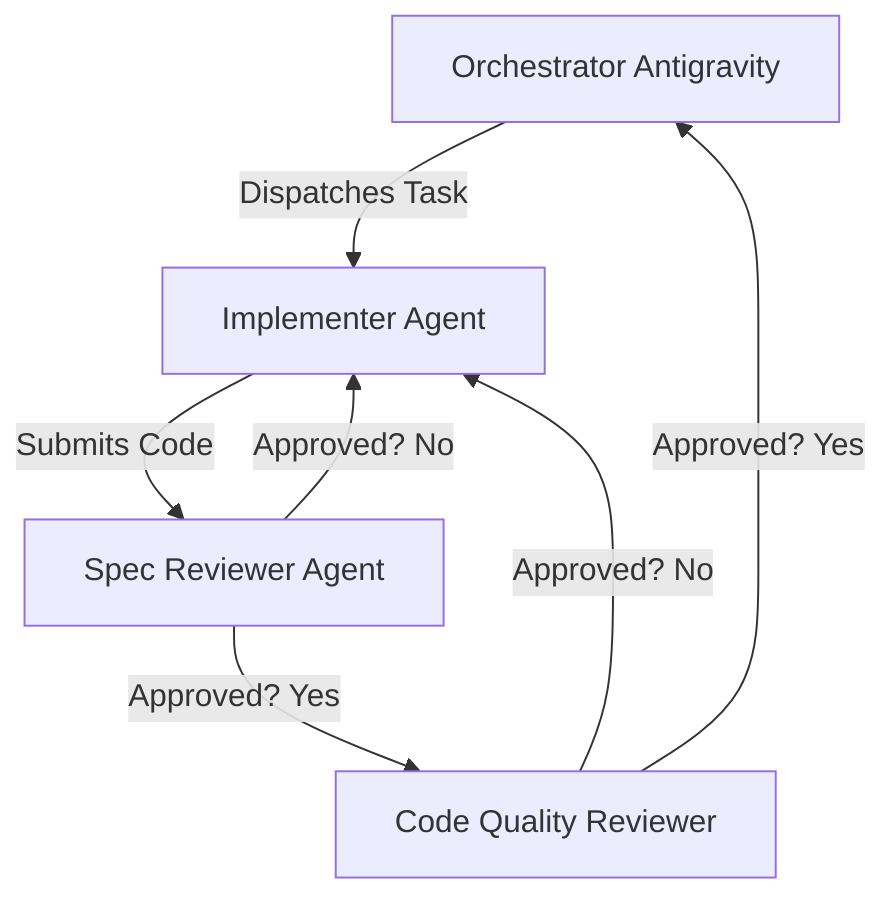

# Project Agents Specification

This document defines the agent roles and collaboration workflow for the StaffPass Local OCR Hub.

## Agent Directory

### 1. Orchestrator (Antigravity)
- **Role:** Main coordinator and planner.
- **Model:** Capable model (Gemini 3.5 Flash / Pro).
- **Responsibilities:**
  - Manages implementation plan (`implementation_plan.md`).
  - Spawns implementation and review subagents.
  - Reviews final integration and resolves conflicts.

### 2. Implementer
- **Role:** Code generator.
- **Model:** Less token-intensive model (Gemini 3.5 Flash - Low).
- **Responsibilities:**
  - Writes production code and unit tests.
  - Adheres strictly to Test-Driven Development (TDD) rules.
  - Commits incrementally.

### 3. Spec Reviewer
- **Role:** Verification gate.
- **Model:** Cheap/fast model.
- **Responsibilities:**
  - Reviews code changes against requirements in the plan.
  - Identifies missing features or over-scoped additions.

### 4. Code Quality Reviewer
- **Role:** Best-practice auditor.
- **Model:** Pro/Advanced model.
- **Responsibilities:**
  - Audits code readability, safety, performance, and structure.
  - Checks for DRY, proper error handling, and clean database transactions.

---

## Workflow Diagram

