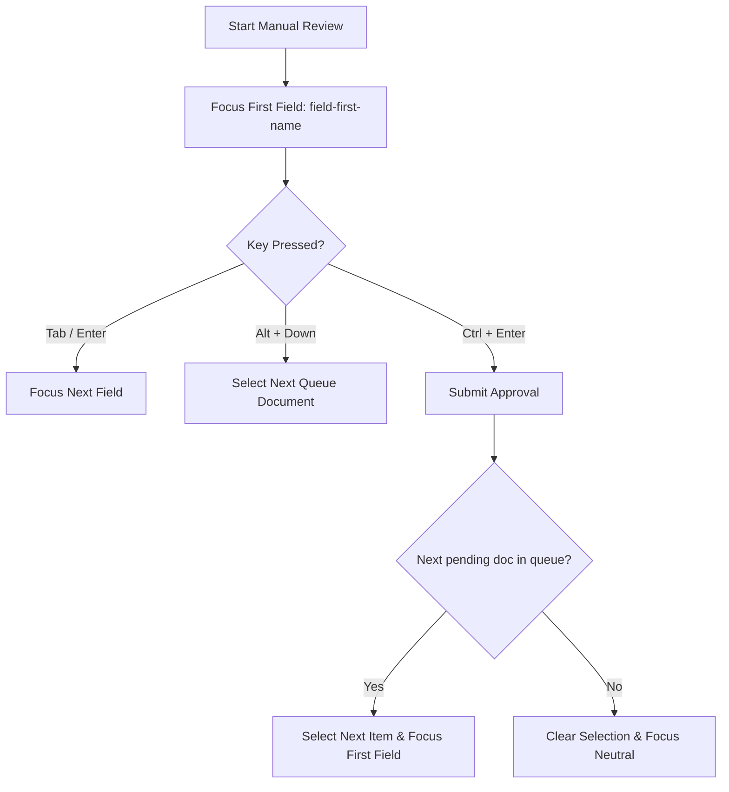

# Specification: Keyboard-Only Review Workflow

This specification details the design for a Keyboard-Only Review Workflow in the StaffPass OCR Hub desktop application. The goal is to maximize data-operator efficiency by eliminating the need for mouse interaction during manual review tasks.

---

## 1. Interaction Model & Keyboard Mappings

When the Review tab is active (`state.activeView === 'review'`) and no modal overlay is visible, the following keyboard mappings are active:

### Queue Navigation
- **`Alt + ArrowDown`**: Select the next document in the review queue.
- **`Alt + ArrowUp`**: Select the previous document in the review queue.

### Form Field Traversal
- **`Tab` / `Shift + Tab`**: Navigate sequentially through the Inspector form inputs.
- **`Enter`**: When focus is in any form text input (except the Correction Notes textarea), pressing `Enter` moves focus to the next field (equivalent to pressing `Tab`).

### Global Review Actions
- **`Ctrl + Enter`**: Approve the active document scan (triggers approval, commits to database, and auto-advances).
- **`Ctrl + Backspace`**: Reject the active document scan.
- **`Ctrl + S`**: Save Corrections made in the Inspector.

---

## 2. Mockup Preview

Below is the visual mockup showing the review screen with inline keyboard shortcut guides:

---

## 3. Workflow Flowchart & Auto-Advance

---

## 4. Code Architecture Changes

The changes will be integrated into the modular JS structure:

### `renderer.js` (Orchestrator)
- Add a listener helper `handleReviewKeyDown(event)` called from the global keydown event listener.
- Intercepts `Ctrl+Enter`, `Ctrl+Backspace`, `Ctrl+S`, and `Alt+Up/Down`.
- Bypasses key intercepts if `whats-new-overlay` or `shortcuts-overlay` `aria-hidden` is not `"true"`.
- Adds focus forwarding for the `Enter` key on fields.

### `renderer/review.js` (Manual Review Panel)
- Modify `saveSelectedReview(reviewStatus)` to implement the **Auto-Advance** logic.
- After a successful database commit, scan `state.queue` to find the next item matching status `queued`, `review`, or `error`.
- Set `state.selectedId` to that item, re-render, and focus the first input.

### `renderer/dom.js` (DOM Utilities)
- Implement `focusNextField(currentElement)` to map the sequential list of text inputs and shift focus programmatically.

---

## 5. Testing Plan

We will add the following tests to `tests/renderer.test.js` to ensure the keyboard actions are validated against regressions:
- Simulating keydowns for `Alt+Down` and verifying queue selection change.
- Simulating `Ctrl+Enter` and checking if `saveSelectedReview` is triggered.
- Simulating `Enter` key focus movement between fields.
- Ensuring overlays disable review shortcuts.
